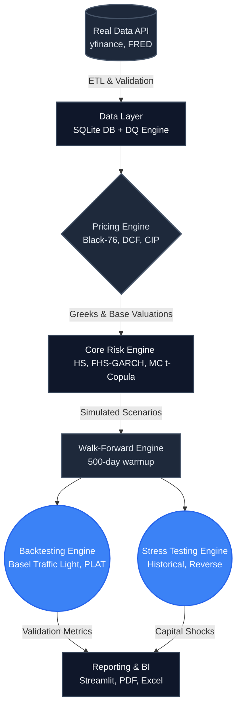

# RiskCore: Enterprise Portfolio Risk & Analytics Platform

**End-to-End Market Risk Model Development, Backtesting, Monitoring, and Governance Framework**

[](.gitlab-ci.yml)
[]()
[]()

---

## 1. Executive Summary

RiskCore is an enterprise-grade Risk Methodologies simulation platform designed to model, measure, and monitor market risk for multi-asset portfolios. Built with Python and heavily influenced by the Fundamental Review of the Trading Book (FRTB) standards, the platform provides a complete ecosystem for quantitative risk developers and validation teams. 

It handles everything from daily market data ingestion and data quality (DQ) checks to advanced stochastic pricing, historical simulation, and complex backtesting frameworks required by internal risk management committees.

### Key Capabilities

*   **Advanced Risk Models**: Implements VaR and Expected Shortfall (ES) models ranging from standard Parametric (delta-normal) to Filtered Historical Simulation (FHS-GARCH) and Monte Carlo t-Copula methodologies.
*   **Regulatory Backtesting**: Features a fully automated walk-forward backtesting engine calculating Kupiec, Christoffersen, and Acerbi-Szekely statistical tests. Includes automated Basel Traffic Light categorization.
*   **FRTB Compliance Tools**: Executes P&L Attribution tests (Spearman Rank Correlation and Kolmogorov-Smirnov distance) to validate Hypothetical vs. Risk P&L.
*   **Counterparty Credit Risk**: Hull-White 1-Factor model implementation for modeling Expected Exposure (EE) and Potential Future Exposure (PFE).
*   **Reporting & BI**: Real-time Streamlit dashboard, alongside automated executive 3-page PDF generation and daily Excel data dumps.

---

## 2. Technology Stack

*   **Core Backend**: Python 3.11+
*   **Data Processing**: Pandas, NumPy, SciPy
*   **Stochastic Modeling & Econometrics**: Arch (GARCH), Statsmodels
*   **Database**: SQLite3 (Local storage for time-series and reporting state)
*   **Visualization & BI**: Streamlit, Plotly, Matplotlib
*   **Reporting Output**: PyMuPDF (PDF generation), Pandas ExcelWriter
*   **Testing & CI/CD**: Pytest, GitLab CI/CD

---

## 3. System Architecture

The framework is built on a modular architecture, separating data ingestion from pricing, risk computation, and reporting layers.



---

## 4. Default Portfolio Composition

The system evaluates risk against a standard multi-asset portfolio tailored to Indian markets. The default configuration can be seamlessly overridden by uploading a custom CSV mapping tickers to share quantities.

*   **Equities**: HDFCBANK.NS, RELIANCE.NS, SBIN.NS, INFY.NS, TCS.NS, ICICIBANK.NS
*   **Options**: Synthetic Nifty 50 Short Call (ATM) and Long Put (OTM hedge)
*   **FX**: USD/INR Forward Contracts
*   **Fixed Income**: 10-Year GOI G-Sec Bond, 5-Year INR OIS Swap

---

## 5. Installation & Quick Start

### Prerequisites
*   Python 3.11 or higher
*   Git

### Setup

```bash
# Clone the repository
git clone https://gitlab.com/your-org/riskcore-lab.git
cd riskcore-lab

# Install package and dependencies
pip install -e ".[dev]"
```

### Running the Pipeline

The RiskCore platform is driven by a comprehensive Command-Line Interface (CLI).

```bash
# 1. Initialize the SQLite database and schemas
marketrisk init-db

# 2. Ingest historical market data (2007 to Present)
marketrisk ingest

# 3. Execute mandatory Data Quality (DQ) checks
marketrisk check-dq

# 4. Execute the daily end-to-end pipeline (Computes models and backtesting)
marketrisk run-daily --date 2024-01-15

# 5. Generate regulatory reports (Excel / PDF)
marketrisk report --date 2024-01-15
```

### Launching the Dashboard

To interact with the data visually, launch the Streamlit server:

```bash
streamlit run app/streamlit_app.py
```
*The dashboard will be available at http://localhost:8502.*

---

## 6. Testing & Validation

The framework utilizes `pytest` to guarantee deterministic pricing and model behavior. The testing suite includes unit tests, integration tests, and fault injection tests to evaluate system resiliency.

```bash
# Run all tests
pytest

# Run specific integration tests
pytest tests/integration/ -v --timeout=120
```

---

## 7. Model Governance Documentation

Robust documentation is a core tenet of RiskCore. The `docs/` directory contains standard artifacts expected by Independent Model Validation Groups (IMVG).

| Document Type | Location | Purpose |
|---------------|----------|---------|
| Model Inventory | `docs/model_inventory.md` | Registry of all active VaR/ES models. |
| Model Development Document | `docs/model_dev_docs/assumptions.md` | Methodological assumptions and math derivations. |
| Validation Report | `docs/validation_report.md` | Independent challenge and challenger model outcomes. |
| Findings Log | `FINDINGS.md` | Executive summary of model limitations and R&D results. |

---

## 8. Disclaimer

**For Educational and Research Purposes Only**

This software is an illustrative framework. It does not replace certified, vendor-provided risk engines used in production banking environments. The simplified models (e.g., Synthetic 3-point yield curves, simplified FRTB implementation, linear options skew) lack the rigor required for actual regulatory capital submissions under Basel IV/FRTB guidelines. 

**RiskCore Analytics | Enterprise Risk Management**
